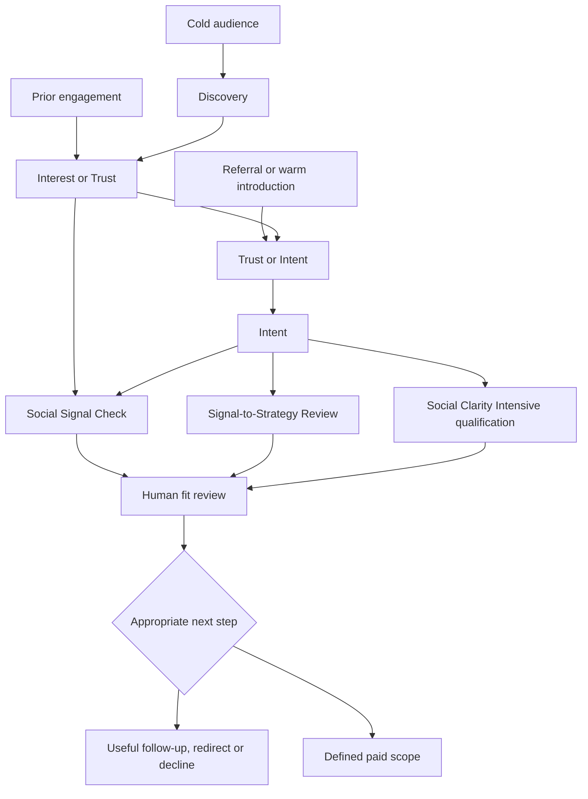
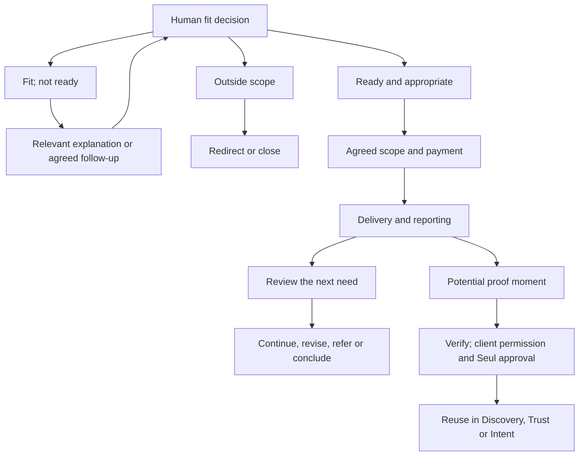

# Phase 4 — Funnel Content Strategy: Working Compilation

**Status:** Owner-approved working strategy draft; approved by Seul on September 24, 2026. This document compiles steps 1–6 discussed in chat. Draft approval does not certify Phase 4 operational completion, authorize production or publication, activate an account, approve offers or prove that a destination works.  
**Audience priority:** Primary Western growth-stage owner-led businesses that have outgrown DIY or fragmented social marketing; secondary Western early-stage owner-operators for development; Philippine growth-stage owner-led businesses as a separate secondary geographic market.  
**Working premise:** One shared journey with audience-specific emphasis. Entry and movement are non-linear. A referral does not establish fit; a self-assessment is not diagnosis; an inquiry is not a sale.

## Source and decision hierarchy

- [Locked Phase 2 audience architecture](../PHASE_2_Audience_Strategy_Part_1.md) and [approved audience intelligence](../PHASE_2_Audience_Strategy_Part_2.md) determine the buyer roles. Older Phase 1 early-stage audience wording does not supersede the locked commercial ICP.
- [Phase 3.2](../Phase-3/PHASE_3.2_Content_Pillar_and_Strategic_Theme_Architecture.md) supplies the five pillars and audience emphases; [Phase 3.3](../Phase-3/PHASE_3.3_Content_Formats_and_Strategic_Roles.md) supplies format roles; [Phase 3.4](../Phase-3/PHASE_3.4_Content_to_Funnel_Mapping.md) supplies offer-to-funnel boundaries; [Phase 3.5](../Phase-3/PHASE_3.5_CTA_Framework.md) supplies CTA categories.
- [Phase 3.6](../Phase-3/PHASE_3.6_Proof_Requirements_and_Content_Governance.md) controls evidence, permission and claims; [Phase 3.8](../Phase-3/PHASE_3.8_Content_Architecture_Operationalization_and_Production_Handoff.md) supplies website routes and qualification; [Phase 3.9](../Phase-3/PHASE_3.9_Content_Architecture_Final_Readiness_Gate.md) supplies operating readiness; [Phase 3.10](../Phase-3/PHASE_3.10_Measurement_and_Validation.md) supplies the approved planning measurement framework; implementation and live baselines remain pending.
- [Phase 2.5.6](../Phase-2.5/PHASE_2.5.6_Offer_and_Pricing_Architecture.md) retains final authority for provisional offer scope and pricing. Do not quote directional figures as approved public prices.
- These are strategic interpretations of repo sources, not findings about CMS buyer behavior. Use the source-confidence method for research; only direct CMS observations can support CMS-specific validation.

## 1. Stage boundaries

Phase 3.4's Recognition and Realization correspond broadly to Phase 4's Discovery and Interest. This mapping retains the underlying distinctions without renaming approved Phase 3 terms.

| Stage | CMS meaning and content responsibility | Boundary and next possible state |
|---|---|---|
| Discovery | A person encounters CMS or notices a relevant symptom. Content makes the business tension recognizable and gives the right audience reason to pay attention. | A view, follow or like does not prove problem awareness. The next state may be Interest or, for a warm arrival, Trust or Intent. |
| Interest | “I want to understand this.” Content explains possible constraints, the difference between symptom and cause, and what to examine. | Curiosity is not buying intent. A resource or preliminary check may help the person clarify the question. |
| Trust | A person evaluates CMS's judgment, method, human accountability and limits. Content shows process and appropriately labeled evidence. | Trust is not synonymous with client outcomes; proof of method may support it before client results exist. Trust questions may arise before or after Intent. |
| Intent | “This may be my business problem, and I may act.” Content explains fit, risk and the proportionate entry route. | A page visit alone is not intent. A specific situation or request may move to qualification. |
| Qualification | CMS and the person establish fit, problem, urgency, readiness and a useful next step. Content helps self-selection and prepares context. | Only human review records qualification and disposition; an assessment or form does not automatically qualify. |
| Conversion | A qualified person accepts a defined right-sized commercial step, potentially a standalone paid diagnosis, finite scope or appropriately diagnosed engagement. | Offer, acceptance, contract and payment are separate events. An inquiry or booking is not a sale. |
| Proof | CMS documents what a method or actual work demonstrates and decides what may be shared. | Method, capability, research, client and outcome proof have different evidence requirements. Approved proof can serve earlier stages. |
| Expansion | An existing client assesses whether to continue, change scope, expand, refer or conclude based on delivered work and the next need. | An upsell is never automatic. Referrals, testimonials and cases are separate decisions with distinct permissions. |

Delivery connects Conversion with Proof and Expansion in the full customer journey. Phase 4 maps relevant client communication and evidence handoffs; it does not redesign delivery operations.

## 2. Entry and movement: possible paths

The three diagnostic entries are alternatives, not mandatory steps. A ready person may approach the paid diagnostic directly for qualification; a clear finite asset need may instead receive a bounded À La Carte assessment. A Social Signal Check returns a preliminary indication, never an automatic diagnosis or sales call.

| Entry condition | Working starting point | What must be learned next |
|---|---|---|
| First encounter | Discovery | Is the issue relevant enough to explore? |
| Prior engagement | Interest or Trust | What does the person already understand, and what remains unclear? |
| Referral or warm introduction | Trust or Intent | What was established by the introducer, and what is the actual business need? |
| Specific request or urgent consequence | Intent | Which bounded route and human review are appropriate? |
| Finite deliverable request | Intent and qualification | Is À La Carte scope sufficient and deliverable? |
| Returns after deferral | Current state, not an automatic restart | What changed, and is follow-up permitted? |

Nurture follows the reason for deferral. Responding to an inquiry does not enroll a person in promotional messages. Client-result proof content is created or shared only after evidence review, the client's use-specific permission and Seul's separate authorization. A referred person starts a new journey at their actual state and still undergoes fit review.

## 3–4. Working stage tables with audience variants

**Pillar key:** P1 Diagnose Before Prescribing; P2 Strategic Social Intelligence; P3 The Reality of Running a Growing Business; P4 Clarity in Practice; P5 Evidence, Proof and What We're Learning. These are internal routing aids, not compulsory audience-facing language or writing sequences. Formats retain the strategic roles defined in Phase 3.3.

### Discovery

| Audience state | Content job; pillar and format | Evidence requirement | CTA and destination | Next decision |
|---|---|---|---|---|
| Western growth-stage (G): activity and ownership feel fragmented | Make the business cost or burden recognizable; P3, Strategic Point of View or Diagnostic Breakdown | Grounded observation; frame unmeasured costs as possible, not established | Attention or Reflection; CMS content/profile | Does the owner want to examine the issue? |
| Western early-stage (E): real offer or credible direction, unclear role for social | Surface the foundation question; P1, Educational Explanation | Approved principle; no invented traction or revenue | Attention or Education; relevant explanation | What needs to be built first? |
| Philippine growth-stage (PH): activity may be disconnected from a business objective | Name a locally intelligible situation; P3, Conversation Prompt or Diagnostic Breakdown | Check local facts; do not generalize from Western data | Reflection or Education; content/resource | Is the problem relevant to this owner? |

### Interest

| Audience state | Content job; pillar and format | Evidence requirement | CTA and destination | Next decision |
|---|---|---|---|---|
| G: asks whether capacity, coordination, strategy or execution is the issue | Distinguish symptom from possible constraint; P1 + P2, Decision Framework | Explain possible causes; framework is not a diagnosis | Education or Self-assessment; resource or preliminary check | Which cause needs examination? |
| E: asks what to handle personally or postpone | Explain minimum decisions before outsourcing; P1, Educational Explanation or Checklist or Self-Assessment | Bounded strategic guidance, not a free individual strategy | Education or Reflection; foundation resource | Is there a defined support need? |
| PH: wants to understand the business role of existing social activity | Connect activity, ownership and objectives; P2, Decision Framework | Philippine operating claims need Philippine evidence | Education or Self-assessment; resource or check | Is the constraint becoming clearer? |

### Trust

| Audience state | Content job; pillar and format | Evidence requirement | CTA and destination | Next decision |
|---|---|---|---|---|
| G: evaluates business understanding and coordination | Show method, accountability and limits; P4 + P5, Process Walkthrough or Proof-of-Method Demonstration | Documented process; verified capability; permissioned cases only | Method; method/proof explanation | What credible concern remains? |
| E: fears buying more support than needed | Show an honest smaller or deferred recommendation; P1 + P4, Decision-Trace Case | Label a sample or hypothetical example | Method or Conversation; bounded explanation | Would right-sized help be useful? |
| PH: evaluates context, communication and responsibility | Explain decisions and handoffs in a relevant context; P4 + P5, FAQ or Process Walkthrough | Verifiable ability and supportable response claims; no invented local proof | Method or Conversation; process explanation | Which risk needs to be addressed? |

These are audience emphases, not universal psychological claims about a country or generation.

### Intent

| Audience state | Content job; pillar and format | Evidence requirement | CTA and destination | Next decision |
|---|---|---|---|---|
| G: recognizes a business consequence and considers help | Explain preliminary check, bounded review and paid diagnosis; P4, FAQ or Process Walkthrough | Accurate scope, output, exclusions and pricing status | Review or Diagnostic; appropriate qualification route | Which route fits the situation? |
| E: wants a foundation but may not need ongoing support | Clarify when a bounded intervention fits; P1 + P4, Decision Framework | Sprint remains working architecture; demand and economics unvalidated | Conversation or Review; bounded fit route | Is a defined finite exchange viable now? |
| PH: considers support for an actual operating problem | Explain diagnostic options in locally clear language; P4, FAQ | Separate Philippine commercial assumptions and approved terms only | Review or Diagnostic; qualified route | Is the scope commercially and operationally suitable? |

### Qualification

| Audience state | Content job; pillar and format | Evidence requirement | CTA and destination | Next decision |
|---|---|---|---|---|
| G: can explain activity, consequence and decision role | Explain required context and human assessment; P4, Process Walkthrough | Locked ICP; fit/problem/urgency/readiness rules; no invented score | Review or Diagnostic; tested intake when available | Human accepts, defers, redirects or declines |
| E: real offer or direction but uncertain support need | Explain bounded foundation assessment; P1 + P4, FAQ | Secondary development ICP and finite offer boundaries | Conversation or Review; bounded intake | Paid finite help or education now? |
| PH: concrete need in a secondary market | Apply the same fit dimensions with separate local commercial context; P4, Process Walkthrough | Client-supplied context; no geographic assumption of readiness | Review or Diagnostic; tested intake | Which scoped service, if any, fits? |

The human reviewer must record fit, problem, urgency, readiness, disposition reason, owner and next action. A click, comment, email address, form or check result alone is not qualification.

### Conversion

| Audience state | Content job; pillar and format | Evidence requirement | CTA and destination | Next decision |
|---|---|---|---|---|
| Qualified G: needs diagnosis or ongoing depth | Explain why defined paid diagnosis or a diagnosed service scope fits; P4 + P5, Process Walkthrough or Decision-Trace Case | Approved scope, staffing, capacity, margin, terms, responsibilities and price | Diagnostic or post-diagnosis Service; verified commercial path only when ready | Accept, revise, defer or decline |
| Qualified E: defined foundation need | Explain finite deliverable and stop point; P1 + P4, Process Walkthrough | Sprint scope, commercial exchange and delivery limits require validation | Service only after fit; approved bounded proposal path | Buy finite support or continue independently |
| Qualified PH: assessed need and local terms | Explain proportionate recommendation; P4, FAQ | Approved Philippine price, scope, capacity and payment terms | Diagnostic or Service; verified path only when ready | Accept, revise, defer or decline |

An Intensive is a standalone paid conversion; purchase never requires a retainer. À La Carte means specific problem, deliverable, outcome and stop point. Core tiers and Sprint remain working commercial architecture until final approval.

### Proof

| Audience state | Content job; pillar and format | Evidence requirement | CTA and destination | Next decision |
|---|---|---|---|---|
| G: seeks evidence for a comparable problem | Demonstrate decision quality and later bounded outcomes; P5, Proof-of-Method Demonstration or Verified Case Study | Explicit sample label or genuine context, timeframe, permission and limits | Method or Review; approved proof | Does it answer the specific risk? |
| E: seeks confidence in finite foundation value | Show what a defined diagnosis or decision helps clarify; P4 + P5, Decision-Trace Case | Sample clearly labeled; do not promise later growth | Method or Conversation; bounded example | Is this depth useful now? |
| PH: needs evidence relevant to local business context | Use actual local proof when available; otherwise explain method and its limits; P5, Proof-of-Method Demonstration or Verified Case Study | Local case needs local direct evidence and permission; keep Western case context explicit | Method or Review; approved proof | Is this evidence applicable? |

A proof candidate from delivery is not automatically a public asset. Before creating or sharing client-result content, record both the client's use-specific permission and Seul's separate authorization; verify that both cover the final asset and intended channel or use. Internal review, referral, testimonial and case-study permissions are separate.

### Expansion

| Audience state | Content job; pillar and format | Evidence requirement | CTA and destination | Next decision |
|---|---|---|---|---|
| G client: reviewing ongoing responsibility | Explain progress and next constraint; P4 + P5, client decision review | Scope, report, effort, outcomes and limitations | Continuation; client review | Continue, change scope, expand or conclude |
| E client: completes bounded support | Explain what the owner can do and what would justify another step; P1 + P5, client learning review | Delivered scope and decisions; no assumed retainer | Continuation if appropriate; review/future contact | Work independently, seek finite help or refer |
| PH client: reviews agreed local scope | Explain progress in actual business context; P4 + P5, client review | Verified local work and approved reporting | Continuation; client review | Renew, revise, expand, refer or conclude |

## 5. Consolidated content → stage → CTA → destination matrix

**Audience codes:** G primary Western growth-stage; E Western early-stage development; PH Philippine growth-stage. **All role assignments below are proposed functions, not named owners.** A live route needs a named person and backup. **No row is currently classified working and tested by the repository evidence.**

| Content; audience | Stage and intended purpose | Pillar; format | Evidence or permission | CTA | Destination; planning status | Owner role; not assigned | Countable event and next decision |
|---|---|---|---|---|---|---|---|
| Fragmentation or owner burden; G, PH | Discovery; relevant recognition | P3; POV/Diagnostic Breakdown | Grounding; PH example checked | Attention/Reflection | Content/profile; **awaiting validation** | Content/community | Relevant response; explain further? |
| Role of social at launch; E | Discovery; foundation recognition | P1; Education | Approved principle, no invented traction | Attention/Education | Content/profile; **awaiting validation** | Content/community | Relevant early-stage response; next question? |
| Symptom versus constraint; G, PH | Interest; understand causes | P1 + P2; Decision Framework | Reasoned possibilities, not diagnosis | Education/Self-assessment | Resource or Social Signal Check; **planned** | Content/route | Resource action and check start/completion separately; clarify need? |
| Minimum viable direction; E | Interest; decide what to build | P1; Education/Checklist | Bounded guidance | Education/Reflection | Foundation resource; **planned** | Content | Specific question or resource action; defined need? |
| CMS diagnostic reasoning; G, E, PH | Trust; examine method | P4 + P5; Process/Method demonstration | Documented method; illustrative label | Method | Observed homepage explanation; **awaiting validation** | Evidence/destination | Method interaction or question; concern resolved? |
| Comparable capability; G, E, PH | Trust; reduce risk | P5; Decision case/Verified case | Work record, context, permission and limits | Method/Conversation | Proof location; **planned** | Evidence/client permission | Relevant proof interaction; ready to share context? |
| Diagnostic route explanation; G, PH | Intent; choose next step | P4; FAQ | Current scope, exclusions, pricing status, local assumptions | Review/Diagnostic | Review/Intensive qualification; **planned** | Commercial/destination | Specific route request; appropriate fit route? |
| Bounded foundation offer; E | Intent; assess finite support | P1 + P4; Decision Framework | Sprint remains working architecture | Conversation/Review | Bounded fit route; **planned** | Commercial | Defined request; finite service viable? |
| Intake expectations; G, E, PH | Qualification; prepare context | P4; Process/FAQ | Accurate intake and response ownership | Review/Diagnostic | Observed homepage form; **awaiting validation** | Human intake/backup | Submission, receipt, first human reply, disposition separately |
| Fit but not ready or unsuitable; G, E, PH | Qualification; honest routing | P1 + P4; Framework/FAQ | Reason recorded; communication preference | Education/Conversation/no CTA | Resource or agreed follow-up; **planned** | Commercial/relationship | Defer, redirect or decline; agreed next action only |
| Standalone paid diagnosis; qualified G, PH or suitable E | Conversion; buy defined clarity | P4; Process | Approved scope, price, output, capacity and payment terms | Diagnostic | Intensive commercial path; **planned** | Commercial/delivery | Offer, acceptance, contract, payment and delivery separately |
| Finite execution/foundation; qualified G, E, PH | Conversion; accept bounded work | P4; FAQ | Approved inputs, revisions, exclusions and stop point | Service | À La Carte/Sprint proposal; **planned** | Commercial/delivery | Proposal, revision, acceptance, contract, payment separately |
| Diagnosed ongoing support; qualified G, PH | Conversion; choose right-sized responsibility | P4 + P5; Decision case | Diagnosis, final scope, staffing, capacity, margin, terms | Service | Reconciled proposal/contract/payment; **planned** | Commercial/delivery | Recommendation and commitment events; sustainable delivery? |
| Illustrative method proof; G, E, PH | Proof; answer method question | P5; Method demonstration | Clear illustrative label; do not imply result | Method | Homepage example **awaiting validation**; new assets **planned** | Evidence | Proof interaction; appropriate reuse stage? |
| Verified work; G, E, PH | Proof; bounded outcome account | P5; Verified Case Study | Work, timeframe, limits, client use-specific permission and Seul authorization before creation or sharing | Method/Review | Approved case location; **planned** | Client permission/evidence | Asset approved for specified use; relevant interactions |
| Client review; existing G, E, PH | Expansion; next business decision | P4 + P5; client decision review | Delivery record, effort, learning and limits | Continuation | Client review process; **planned** | Relationship/delivery | Renewal, scope change, expansion or conclusion separately |
| Optional advocacy; existing G, E, PH | Expansion; appropriate new relationship/proof | P5; approved learning | Distinct referral, testimonial and case permissions | Continuation | Referral/permission process; **planned** | Relationship/permission | Referral or distinct permission/decline recorded |

An explicit CTA is optional when it does not serve the piece. A planned or awaiting-validation destination is suitable for internal planning, not public promotion. The September 20, 2026 homepage review saw a form and illustrative diagnosis but did not submit the form or test booking, payment, notification, records, analytics or follow-up. Do not infer their absence or functioning from that review.

## 6. Governance decisions and release controls

| Check | Required rule for the matrix |
|---|---|
| Offer boundaries | Intensive stands on its own. À La Carte remains finite. Sprint and core tiers are working architecture; final scope, pricing, capacity, margin and qualification rules need approval. PH terms require a separate market decision. |
| Qualification | Human review records fit, problem, urgency, readiness, disposition reason, assigned next action and due date. Do not infer fit from engagement or form completion. |
| Proof | Method demonstrations are labeled. Before creating or sharing client-result material, obtain the client's use-specific permission **and** Seul's separate authorization; check both against the final wording and intended use. Client cases also need genuine work, evidence, context, timeframe, limitations and attribution. Internal delivery records are not automatically public. |
| Nurture | Respond to the inquiry separately from optional promotional subscription. Record deferral reason, communication preference, agreed follow-up and owner. Respect declines and stop requests; no automatic sequence. |
| Measurement | Each active row needs a defined event, source, named owner, observation window, audience where known, raw numerator and denominator for rates, and unknown-data note. Do not infer causation from source association. |
| Destination and capacity | Before a live CTA, test the link/action, successful receipt, confirmation and failure handling, owner notification, lead record, assigned owner and backup, realistic response window and release approval. Booking/contract/payment need separate authorized tests. |

### Qualification rate; resolved definition

Seul selected **all submissions** as the qualification denominator on September 24, 2026. Phase 3.8 and Phase 3.10 now use one definition: qualified submissions from a defined submission cohort divided by **all submissions in that cohort** by a stated review cutoff. Record qualified, reviewed and unreviewed counts alongside the rate. An unreviewed case remains in the denominator; a backlog may lower the provisional rate. Do not calculate the rate with a zero denominator or claim that an incomplete review shows buyer fit. Segment G, E and PH only where known.

### Destination status and release rule

- **Planned:** Route is specified in architecture; implementation is not verified.
- **Awaiting validation:** Account, page or form was reserved or observed, while present content and end-to-end operation remain unverified.
- **Working and tested:** A dated end-to-end test confirms the promoted action, confirmation, receipt, human owner/follow-up, measurement and known issues. **No route currently has that designation in the repository record.**

No public post, promotion or business promise follows automatically from this strategy. In particular, the one-business-day reply promise observed on the homepage needs a real owner and sustainable response capacity before it is repeated or treated as dependable.

## Remaining work for final Phase 4 strategy approval

The eight stage definitions, optional routes, audience variants and matrix are approved as a working strategy. The qualification definition is now reconciled. Phase 2.5.10 planning handoff and the Phase 3.9 Green planning decision are recorded; Phase 3.10 is an approved planning framework. Final Phase 4 *strategy* approval requires Seul to review this reconciled version and record the Phase 4 closeout decision and date. No separate live test, final price or platform launch is required to approve a planning document when dependencies are explicitly staged.

### Handoff after strategic approval; activation dependencies

1. Finalize applicable offer scope, public prices, capacity, margins and PH commercial terms through Phase 2.5.6 before presenting the affected offer as available.
2. Assign named owners and backups; verify intake and response capacity; test each intended destination and its event capture end to end before a public CTA.
3. For client-result material, obtain the client's use-specific permission and Seul's separate authorization before creation or sharing; check both against the final asset and use.
4. Record real buyer, trust, delivery and measurement observations; update Phase 2.5.9 and revisit 2.5.10 when material evidence challenges assumptions.
5. Carry approved strategic intent into Phase 5 platform-specific planning when authorized; production and publication still require their own approvals.

**Current outcome:** Phase 4 working strategy draft is owner-approved and its qualification conflict is resolved. Final reconciled Phase 4 strategy closeout awaits Seul's review. Operational activation, commercial validation, production and publication remain separate decisions.
